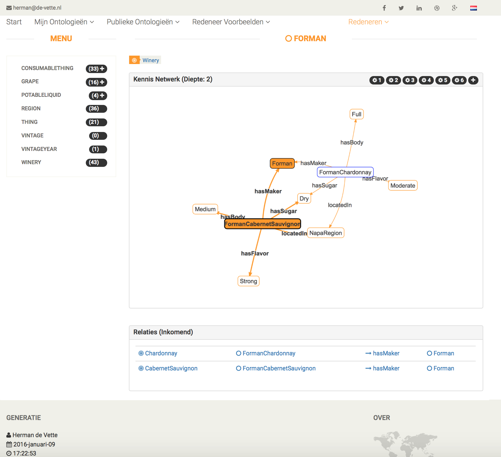

OWL2HTML 
=======

A Project for experiments with reasoning and visualization of knowledge representated in the OWL2 language. (see the [w3c specification](http://www.w3.org/TR/owl2-syntax/))

The OWL 2 Web Ontology Language, informally OWL 2, is an ontology language for the Semantic Web with formally defined meaning.
OWL 2 ontologies provide classes, properties, individuals, and data values and are stored as Semantic Web documents.
OWL2 is a W3C Recommendation and is a

I noticed the power of OWL2 knowledge representation in complex software projects, where it was necessary to relate many facts with each other.
OWL2 provides a way to relate these facts, and provides flexibility, changeability of these facts. It also provided a possibility to find referring facts,
which is extremely useful for impact analysis.

- Webapp:
This project contains a webapp to get a runtime visualization of knowledge in OWL2 files.

- App:
This project contains an app to generate offline html files with browsable and visualized knowledge of the OWL2 file. Useful to show the knowledge to

- Maven plugin:
This project contains a maven plugin to start offline (generated html) or online (web server) visualization of the owl2 files.

======

Tools necessary to build this project

- Java JDK 1.7 - http://www.oracle.com/technetwork/java/javase/downloads/index.html
- Maven - http://maven.apache.org

Optional:
- Node - https://nodejs.org/en/
- Bower - http://bower.io
- IntelliJ - https://www.jetbrains.com/idea/download/

A Good OWL2 editor:
- Protégé - http://protege.stanford.edu
- Neon Toolkit - [http://neon-toolkit.org/wiki/Main_Page.html](http://neon-toolkit.org/wiki/Main_Page.html)
- Or choose another one from this [list of ontology editors](http://www.w3.org/wiki/Ontology_editors)

======

GETTING STARTED:

    1. Open a terminal window in the root of the project.
    2. mvn clean install
    3. cd OWL2HTML-web
    4. mvn jetty:run
    6. open the browser of your choice and go to url: http://localhost:8080/OWL2HTML-web/select?

The build may be a little slow, because the Hermit build is slow. You can exclude the hermit build from your regular build
after a first build, use the command below as a replacement for 'getting started step 2':

    mvn clean install -Pfast

======

LEARN MORE:
- [The hard way from the w3c specification](http://www.w3.org/TR/owl2-syntax/)
- [Look at some video's from Open HPI's "Knowledge Engineering with Semantic Web Technologies 2015"](https://open.hpi.de/courses/semanticweb2015)
- [Subscribe to the upcoming course from Open HPI "Linked Data Engineering"](https://open.hpi.de/courses/semanticweb2016)
- [A really good tutorial about reasoning](http://dior.ics.muni.cz/%7Emakub/owl/#java)